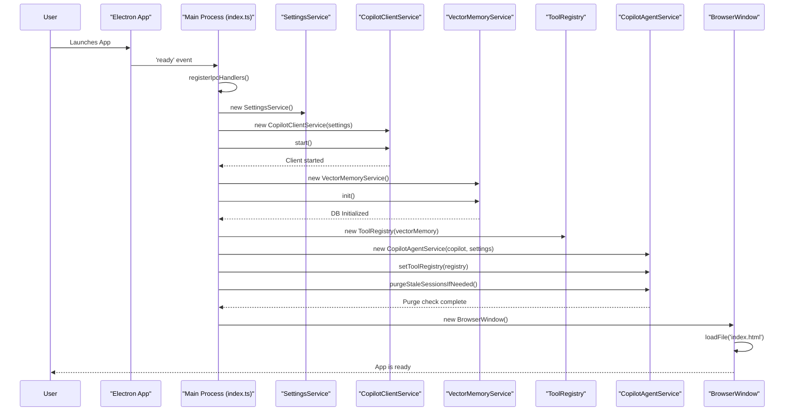
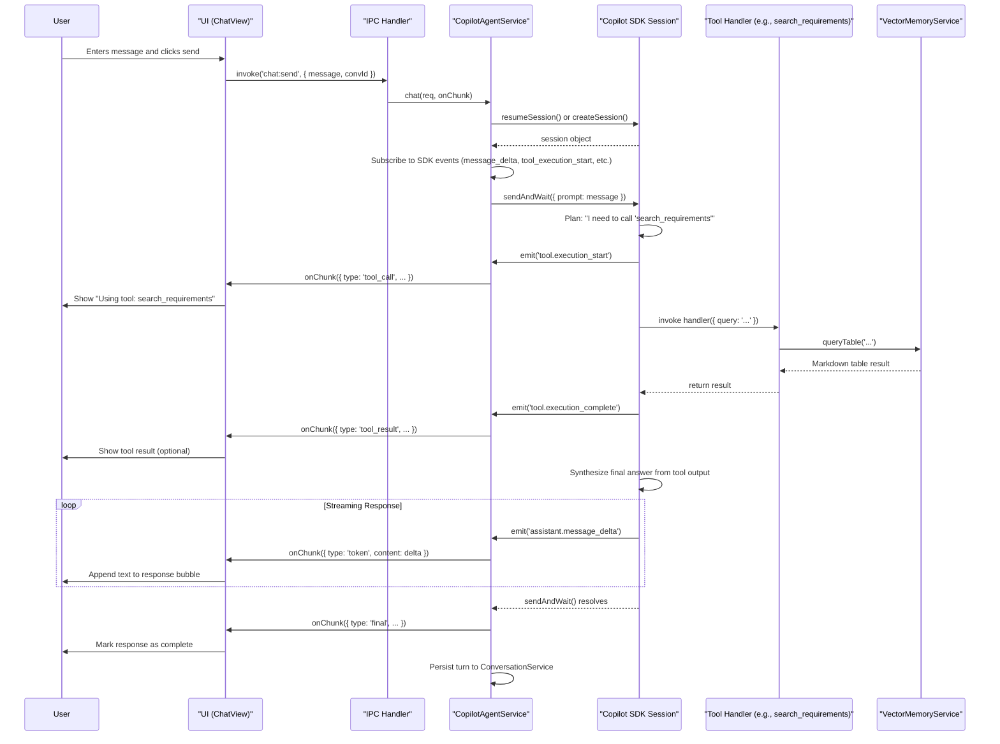

# Mimi AI Agent: System Design & Project Documentation

> This document provides a comprehensive overview of the AI Agent Electron application, covering its architecture, core components, data flows, and operational guides. It is intended for developers, new team members, and product stakeholders.

---

## 1. System Design

The Mimi AI Agent is a native desktop application built with Electron and React, designed to act as an intelligent assistant for engineering workflows. It leverages Large Language Models (LLMs) via the GitHub Copilot SDK to understand user queries, use a variety of tools to interact with data sources (like Jira and a local requirements database), and synthesize complex answers.

### 1.1. Architectural Principles

- **Modularity:** The system is composed of distinct, loosely-coupled components. The agent's reasoning core is separate from its tools, and the UI is separate from the backend logic. This allows for independent development and extension.
- **Security:** As a desktop application, it prioritizes local data security. The main process, which handles all sensitive operations and data access, is strictly isolated from the renderer (UI) process. The `contextBridge` in Electron is used to expose a narrow, secure API, and sensitive credentials are never exposed to the UI.
- **Extensibility:** The agent's capabilities can be expanded in two primary ways:
  1.  **Adding Tools (Code):** Developers can add new imperative functions (e.g., `get_user_profile`) for the agent to execute.
  2.  **Adding Skills (Prompts):** Users or developers can add new declarative strategies in natural language (e.g., "how to generate a weekly report") that instruct the agent on _how_ to combine its tools to achieve a goal.
- **Robustness:** The agent is designed for stability. It includes graceful error handling within tools to prevent a single tool failure from crashing the entire reasoning chain. It also features a session fingerprinting mechanism that automatically purges stale, cached reasoning plans when the underlying tools or prompts change, preventing difficult-to-debug errors.

### 1.2. Core Architecture

The application is split into two main processes, a standard model for Electron apps:

1.  **Main Process (`src/main`):** The backend of the application. It runs in a Node.js environment and is responsible for:
    - Hosting the entire AI agent core (`CopilotAgentService`, `ToolRegistry`).
    - Managing connections to external services (GitHub Copilot, Vector DB).
    - All file system access and data persistence.
    - Handling IPC (Inter-Process Communication) calls from the UI.

2.  **Renderer Process (`src/renderer`):** The frontend of the application. It is a React single-page application responsible for:
    - Displaying the chat interface, settings, and history.
    - Sending user requests to the main process via a secure `window.electronAPI`.
    - Receiving and displaying streamed responses from the agent.

### 1.3. Key Components

- **Agent Orchestrator:** The "brain" of the agent. It manages the reasoning loop of receiving a prompt, planning tool calls, executing them, and generating a final response. The system supports a dual-orchestrator strategy:
  - `CopilotAgentService` (Default): Built on the `@github/copilot-sdk`, this is a robust and efficient engine for most tool-calling tasks.
  - `LangGraphAgentService` (Experimental): A more complex state machine-based orchestrator for tasks requiring explicit, multi-step logic or reflection.

- **ToolRegistry:** A central repository that holds all the "tools" (atomic capabilities) the agent can use. It lazy-loads tools to ensure a fast application startup.

- **Tools (`/tools/*.ts`):** These are the concrete functions the agent can execute, defined using the Copilot SDK's `defineTool` function. Each tool has a clear description (critical for the LLM to decide when to use it) and a schema for its parameters.

- **VectorMemoryService:** A wrapper around a vector database (e.g., ChromaDB) that provides the agent with long-term memory. It ingests documents (like software requirements), converts them to embeddings, and allows for fast semantic search. This powers tools like `search_requirements`.

---

## 2. Component Diagram

This diagram visualizes the high-level structure and interactions between the major components of the agent application.

```mermaid
componentDiagram
    subgraph "Renderer Process (UI)"
        ReactApp[React UI]
    end

    subgraph "Main Process (Backend)"
        IPCHandler[IPC Handler]
        subgraph "Agent Orchestrator"
            direction LR
            CopilotAgent[CopilotAgentService]
            LangGraphAgent[LangGraphAgentService]
        end
        ToolRegistry[ToolRegistry]
        CopilotClient[CopilotClientService]
        SettingsService[SettingsService]
        ConversationService[ConversationService]

        subgraph "Tools"
            direction TB
            ReqTools[requirementTools.ts]
            JiraTools[jiraTools.ts]
        end

        subgraph "Data Services"
            direction TB
            VectorMemory[VectorMemoryService]
            JiraService[JiraService]
        end
    end

    subgraph "External Systems"
        GitHubCopilot[GitHub Copilot Backend]
        ChromaDB[Vector DB]
        JiraAPI[Jira Cloud API]
    end

    ReactApp -- "IPC via window.electronAPI" --> IPCHandler
    IPCHandler --> CopilotAgent
    IPCHandler --> LangGraphAgent
    IPCHandler -- "Manages" --> SettingsService
    IPCHandler -- "Manages" --> ConversationService

    CopilotAgent -- "Uses" --> CopilotClient
    CopilotAgent -- "Uses" --> ToolRegistry
    LangGraphAgent -- "Uses" --> ToolRegistry

    CopilotClient -- "Communicates with" --> GitHubCopilot

    ToolRegistry -- "Contains" --> ReqTools
    ToolRegistry -- "Contains" --> JiraTools

    ReqTools -- "Depends on" --> VectorMemory
    JiraTools -- "Depends on" --> JiraService

    VectorMemory -- "Connects to" --> ChromaDB
    JiraService -- "Connects to" --> JiraAPI
```

---

## 3. Application Startup Sequence

The following diagram illustrates the sequence of events when the application is launched.



---

## 4. User Query Processing Sequence

This diagram shows how a user's message is processed by the agent from submission to final response.



---

## 5. New Member Onboarding Guide

Welcome to the team! This guide will help you understand the Mimi AI Agent project, get your development environment set up, and start contributing.

### 5.1. Introduction

This project is a desktop AI assistant built with Electron, React, and TypeScript. Its purpose is to provide a powerful, tool-using agent that can connect to real engineering data sources (like Jira and requirements databases) to automate complex analysis and reporting tasks.

### 5.2. Core Concepts

To work effectively on this project, it's essential to understand these key abstractions:

#### Tools vs. Skills

- **Tools** are **imperative capabilities**. They are concrete TypeScript functions the agent can execute, like `get_ticket_details`. They are the agent's "hands" and represent _what_ it can do.
- **Skills** are **declarative strategies**. They are natural language instructions injected into the system prompt that tell the agent _how_ to use its tools to accomplish a higher-level task. For example, the `jira_analysis` skill provides a step-by-step playbook for analyzing a ticket.

This separation is powerful. It allows us to change the agent's strategic behavior by editing plain text in `src/shared/skills.ts` without touching any tool implementation code.

#### Dynamic Prompt Engineering

The agent's system prompt is not static. It's built on-the-fly for each conversation by `CopilotAgentService`, combining:

1.  A base system prompt (persona, core instructions).
2.  The instructions from all enabled "Skills".
3.  A "Semantic Gate" addendum that encourages self-correction.

#### Session Fingerprinting

The Copilot SDK caches reasoning "plans" for conversations to improve performance. This can cause issues when we update a tool or a skill prompt, as the agent might use an outdated, cached plan.

The `purgeStaleSessionsIfNeeded()` method in `CopilotAgentService` solves this. On startup, it calculates a SHA1 hash (a "fingerprint") of the current tool names and skill prompts. If this fingerprint doesn't match the one from the last run, it deletes the entire SDK session cache, forcing the agent to create fresh plans with the latest configuration. This is a critical mechanism for stability.

### 5.3. Tech Stack

| Layer      | Technology                                                             |
| ---------- | ---------------------------------------------------------------------- |
| Shell      | **Electron** (Cross-platform native window)                            |
| Language   | **TypeScript** (Strict mode, for main and renderer)                    |
| UI         | **React**, **Tailwind CSS**, **shadcn/ui**                             |
| Agent Core | **@github/copilot-sdk** (Reasoning loop, tool calling)                 |
| Embeddings | **@xenova/transformers** (Offline-capable sentence-transformer models) |
| Vector DB  | **ChromaDB** (For semantic search on requirements)                     |
| State Mgmt | **Zustand** (Lightweight state management for React)                   |
| Bundler    | **Vite** (Renderer) + **esbuild** (Main)                               |

### 5.4. Project Structure

```
src/
├── main/         # Backend: Node.js / Electron main process
│   ├── agent/    # The AI agent's core logic, orchestrator, and prompts
│   ├── data/     # Services for data persistence and access (e.g., VectorMemoryService)
│   ├── ipc/      # IPC handlers that respond to requests from the UI
│   └── tools/    # All tool definitions (e.g., requirementTools.ts)
│
├── preload/      # Electron security bridge, exposes `window.electronAPI`
│
├── renderer/     # Frontend: React SPA
│   ├── components/ # Reusable React components
│   ├── store/      # Zustand state management stores
│   └── views/      # Top-level page components (ChatView, SettingsView)
│
└── shared/       # TS files imported by BOTH main and renderer
    ├── ipc-types.ts # The single source of truth for all IPC channel names and data types
    └── skills.ts    # Definitions for all agent "Skills"
```

### 5.5. Getting Started

1.  **Prerequisites:** The Copilot SDK requires the Copilot CLI to be globally installed.

    ```bash
    npm install -g @github/copilot-cli
    gh auth login # Authenticate with GitHub
    ```

2.  **Install Dependencies:** Clone the repository and install the project's dependencies.

    ```bash
    git clone <repo_url>
    cd AI-Agent-ElectronApp
    npm install
    ```

3.  **Environment Setup:** Create a `.env` file in the project root by copying `.env.example`. You must fill in `GITHUB_TOKEN`. You can get one by running `gh auth token`.

    ```bash
    cp .env.example .env
    # Now edit .env and add your token
    ```

4.  **Run in Development:**
    ```bash
    npm run dev
    ```
    This will launch the Electron application with hot-reloading for both the main and renderer processes.

### 5.6. How to Add a New Tool

1.  **Open a tool file:** Navigate to `src/main/tools/` and choose the relevant file (e.g., `requirementTools.ts`) or create a new one.
2.  **Define the tool:** Use the `defineTool` function from the Copilot SDK.
3.  **Write a great description:** This is the most important step. The LLM uses this description to decide when to call your tool. Be explicit about what it does, when to use it, and what it returns.
4.  **Define parameters:** Use JSON Schema to define the arguments your tool expects. Provide clear descriptions for each parameter.
5.  **Implement the handler:** This is the async function that contains your tool's logic.
    - **Always** wrap your logic in a `try...catch` block.
    - On error, return a descriptive string like `"Error: <message>"`. **Do not throw exceptions**, as this can halt the agent's entire reasoning process.
    - Return pre-formatted Markdown where possible (e.g., tables) to make the LLM's final synthesis step easier and more reliable.
6.  **Register the tool:** Ensure your new tool is exported and added to the array of tools created in the `make...Tools` function, which is then consumed by the `ToolRegistry`.

### 5.7. How to Add a New Skill

1.  **Open `src/shared/skills.ts`:** This file is the single source of truth for skills.
2.  **Add a `SkillDefinition`:** Add a new object to the `SKILL_DEFINITIONS` array.
3.  **Fill in the properties:**
    - `key`: A unique identifier (e.g., `code_review_summary`).
    - `label`: A user-friendly name (e.g., "Code Review Summary").
    - `description`: A short explanation for the settings UI.
    - `relatedTools`: A list of tool names this skill primarily uses.
    - `defaultInstruction`: The natural language steps for the agent to follow. This is the core of the skill. Be clear, specific, and tell the agent what format to use for its output.
4.  **That's it!** The new skill will automatically be available in the agent's settings UI and will be incorporated into the system prompt when enabled.

---

## 6. Marketing & Feature Highlights

### Mimi AI Agent: Your Intelligent Desktop Assistant for Complex Engineering Workflows

**Go beyond chat. Automate analysis, generate reports, and connect directly to your engineering data with a powerful, tool-using AI that lives on your desktop.**

The Mimi AI Agent is not just another chatbot. It's a native application that integrates deeply with your local and cloud-based engineering tools, acting as a true assistant to accelerate your most complex tasks.

### Key Features

- **Powerful Tool Integration**
  Connects directly to your data sources like Jira and internal requirement databases. It doesn't just talk _about_ your data; it actively _works_ with it to find information, identify gaps, and generate insights.

- **Customizable "Skills" Engine**
  Teach the agent new strategies without writing a single line of code. Our unique 'Skills' system lets you define complex, multi-step workflows in plain English. Guide the AI on how to perform tasks like "Jira Ticket Analysis," "Test Case Generation," or "ISO 26262 Gap Analysis" using the tools it already has.

- **State-of-the-Art Reasoning**
  Powered by the latest models via the GitHub Copilot SDK, ensuring robust and reliable tool-calling and reasoning capabilities. The agent can intelligently plan which tools to use, in what order, to best answer your query.

- **Secure & Private by Design**
  As a native desktop application, Mimi AI Agent keeps your sensitive data and credentials secure. Your GitHub and Jira tokens are encrypted and stored locally on your machine using OS-level security, never leaving your control.

- **Real-Time, Streaming Interface**
  Get answers and see the agent's work-in-progress instantly. The responsive, streaming UI shows you not only the final answer but also which tools the agent is using in real-time, providing full transparency into its thought process.

- **Offline-Capable Semantic Search**
  Leverages a local vector database to perform lightning-fast semantic searches on your requirements documents. Find the exact requirement you need with a natural language query, even if you're offline.

### Who Is It For?

- **Systems & Safety Engineers:**
  Perform comprehensive gap analysis against standards like ISO 26262 or ASPICE. Ask "Are there any requirements related to cybersecurity that are unassigned?" and get an immediate, actionable list.

- **Software Developers:**
  Stop hunting through documentation. Instantly find related requirements, dependencies, and test cases for the Jira ticket you're working on. Ask "Generate unit tests for requirement Core_01150."

- **Project Managers & Team Leads:**
  Automate tedious reporting. Generate weekly progress reports, identify blocked tickets, and get a high-level overview of team workload directly from Jira data with a single prompt.

### Get Started

Download the Mimi AI Agent today and supercharge your engineering productivity.

---
