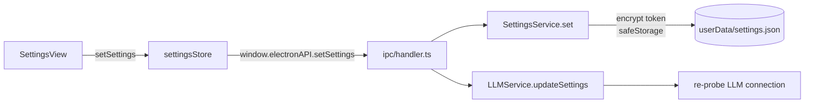
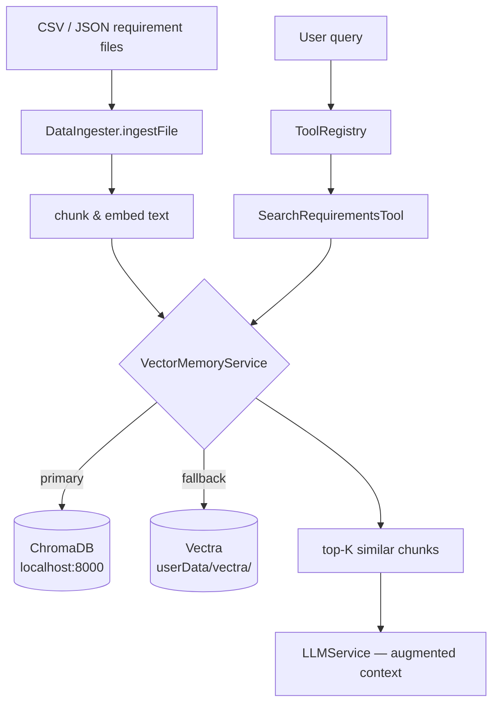
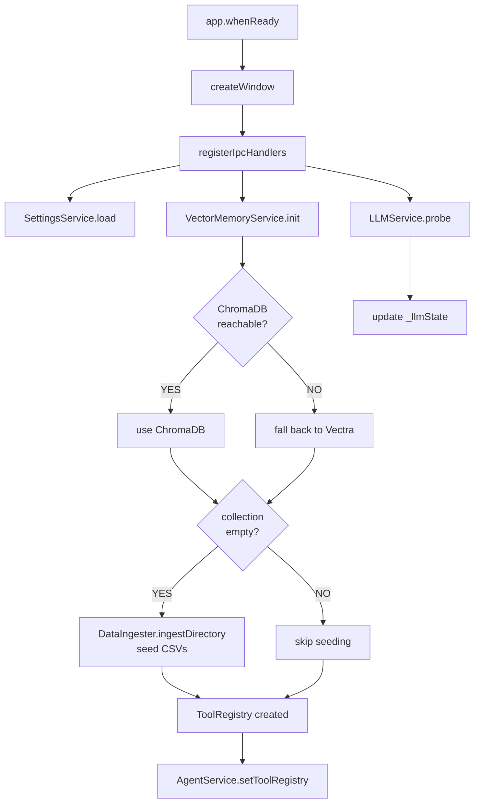
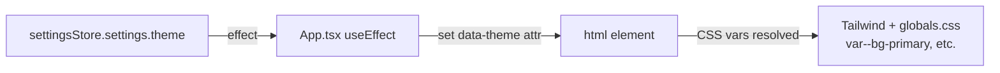

# Data Flow

## Overview

All data in the system flows through a single direction:

```
User Input → Renderer → IPC → Main Process → LLM / Vector DB → IPC Stream → Renderer
```

---

## Chat Message Flow

```mermaid
flowchart TD
    A([User types message]) --> B[InputBar.tsx]
    B --> C[chatStore.sendMessage]
    C --> D["window.electronAPI.sendMessage(req)"]
    D -->|IPC invoke: chat:send| E[ipc/handler.ts]

    E --> F[AgentService.chat]

    F --> G{SemanticGate\n.validate}
    G -->|REJECT| H[stream error chunk]
    G -->|PASS| I[MemoryService\n.buildMessages]

    I --> J[LLMService\n.streamChat]
    J -->|streaming tokens| K["win.webContents.send\n(chat:chunk, token)"]
    K -->|IPC on: chat:chunk| L[chatStore onChatChunk]
    L --> M[ChatView renders token]

    J --> N{tool_calls\nin response?}
    N -->|YES| O[ToolRegistry.run]
    O --> P[requirementTools\nvector search / analysis]
    P --> Q[append ToolMessage]
    Q --> J

    N -->|NO — final| R[MemoryService.persist]
    R --> S[ConversationService\n.appendMessages]
    S --> T[(userData/conversations/\n{id}.json)]
```

---

## Settings Flow



---

## Vector Memory & Data Ingestion Flow



---

## Startup Initialization Flow



---

## Theme / UI State Flow



---

## Key Data Structures

### `ChatRequest` (renderer → main)

```typescript
{
  message: string
  conversationId: string
}
```

### `ChatChunk` (main → renderer, streamed)

```typescript
{
  type: 'token' | 'tool_call' | 'tool_result' | 'final' | 'error'
  content: string
  toolName?: string
}
```

### `Message` (stored in conversation JSON)

```typescript
{
  id: string
  role: 'user' | 'assistant' | 'tool'
  content: string
  createdAt: string
  toolName?: string
}
```

### `AppSettings` (persisted in userData)

```typescript
{
  githubToken: string // AES-encrypted via safeStorage
  llmBaseUrl: string // GitHub Copilot endpoint
  llmModel: string // e.g. "gpt-4o"
  llmMaxTokens: number
  llmTemperature: number
  chromaHost: string
  chromaPort: number
  theme: 'light' | 'dark' | 'system'
  logLevel: 'debug' | 'info' | 'warn' | 'error'
}
```
