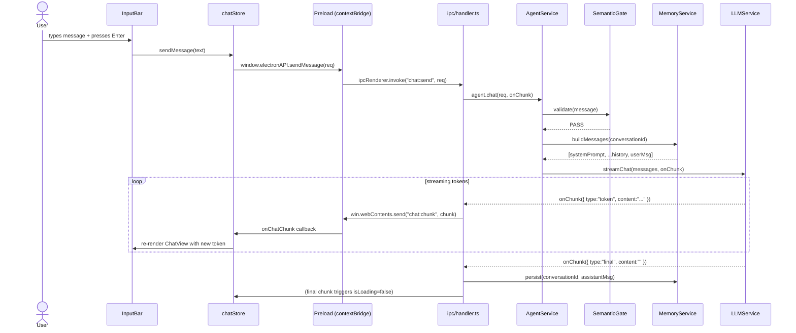
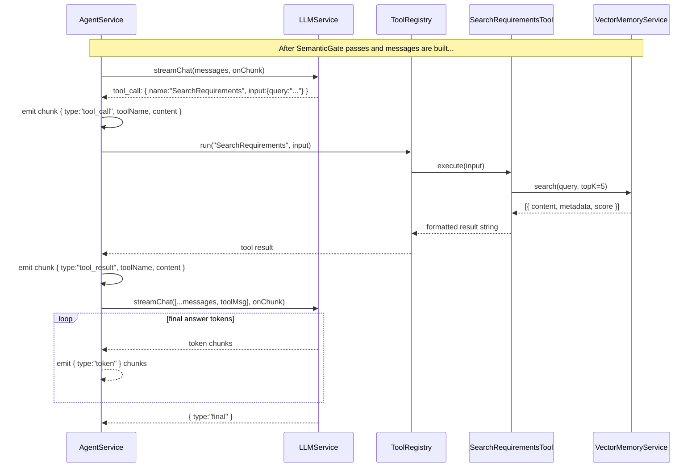
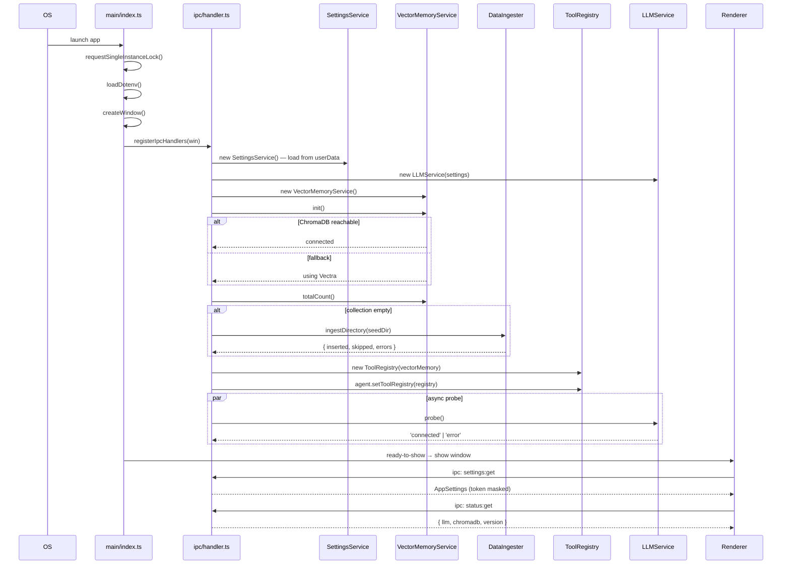
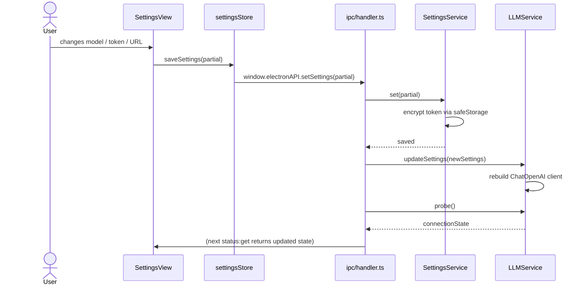
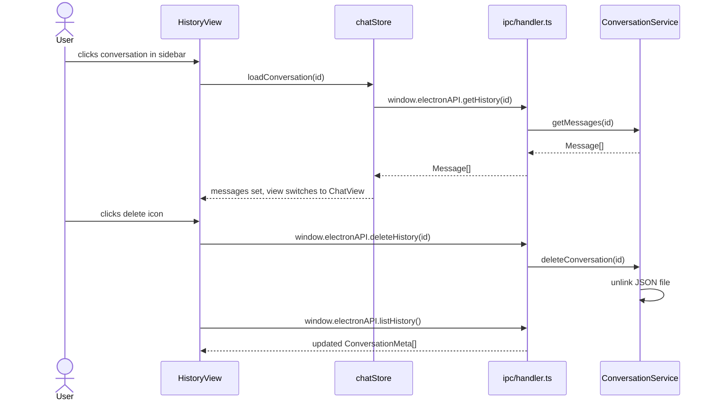
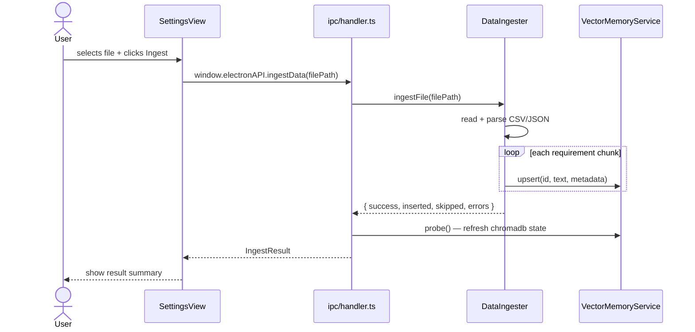

# Sequence Diagrams

## 1. User Sends a Chat Message (No Tools)

---

## 2. User Sends a Message (Tool Calling)

---

## 3. App Startup

---

## 4. Settings Update

---

## 5. Conversation History Navigation

---

## 6. Data Ingestion

